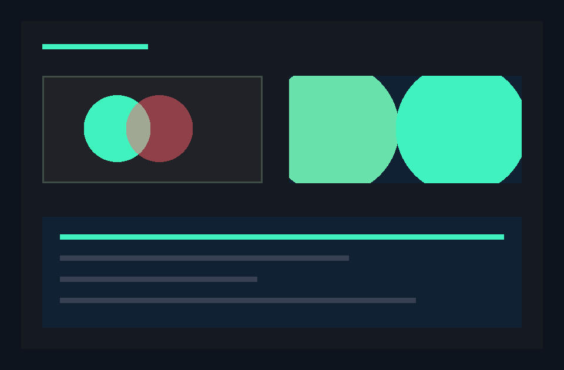
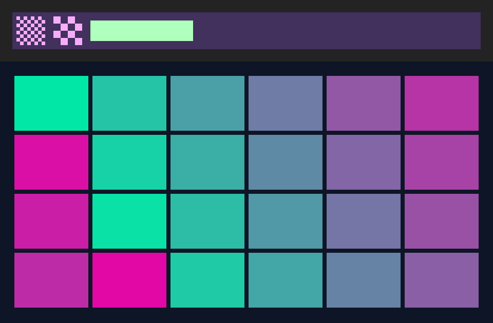

# Voltra

**GPU access and presentation for Bend 2, on Vulkan.**

Voltra is the GPU layer of the AMAGE UI ecosystem. It picks a Vulkan device,
builds a swapchain for a window that [Ankra](https://github.com/amage-si/ankra)
owns (or an offscreen image), uploads textures and atlas regions, and draws
instanced 2D quads: flat fills, images, coverage masks and antialiased rounded
boxes and rings, each clipped. A retained canvas keeps the last picture, so a
frame can redraw only the rectangles that changed and tell the compositor
which ones they were. Then it presents, resizes and tears down cleanly. The library is written in Bend 2; the only native code is a thin,
documented bridge of Vulkan calls exposed as Bend effects.

**Status:** early Linux implementation, tested with **Bend 2.0.36** on an
NVIDIA GeForce RTX 3050 Laptop GPU (driver 610.57.04, Vulkan 1.4.341) under
Hyprland/XWayland. The first priority is a polished, measured experience on
the development Linux machine. Compatibility layers will follow proven progress.



The capture above is a frame rendered by [Chromi](https://github.com/amage-si/chromi)
on the CPU and presented by Voltra on the GPU in an Ankra window. It is
identical, pixel for pixel, to Chromi's own output (all 604,800 pixels).
Chromi's integrated demo (`examples/eco`) draws its frames through Voltra's 2D
quads instead, redrawing only what changed; see its README.

## What works today

- Device selection: every Vulkan GPU is reported (type, vendor, device, API
  and driver versions, device-local memory, maximum image size), and the best
  Vulkan 1.3+ device that can present to the window is chosen.
- A presentation surface made from the native window Ankra hands over (Xlib
  `Display*` and window id). Voltra opens no window and reads no window
  events; window size changes come from Ankra's `Resized` events.
- A swapchain with explicit format, present mode (FIFO by default),
  image-count and composition choices, rebuilt on every real resize and on
  out-of-date or suboptimal presentation.
- A 2D primitive pipeline: one instanced draw of 16-word quads, five kinds
  (flat, nearest-texel image with tint, coverage mask, rounded box, ring),
  each with a clip box. Every coverage and color value is computed with
  integer arithmetic in the shader, so a CPU renderer following the same
  rules produces the same bytes. Straight-alpha source-over blending in
  encoded sRGB, as Chromi's CPU composition.
- A retained canvas per target (`paint`): the picture stays from one frame to
  the next, so a frame can redraw only some rectangles, each with its own
  instances and the scissor on it, before the canvas is copied into the
  acquired swapchain image; a whole paint clears it first (a first frame, a
  new size). The present then names the changed rectangles
  (`VK_KHR_incremental_present`, enabled when the device offers it). New
  atlas regions are copied inside the same frame, so the CPU never waits for
  the device. `draw` still draws whole frames straight into the image.
- Textures: whole-image uploads, blank textures with rectangle updates in one
  transfer (`update`), and an atlas allocator (`atlas.bend`, shelves; entries
  found by key in a persistent map, `keys.bend`).
- `keys.bend`: a persistent map from U32 keys to Data values (big-endian
  Patricia trie): lookups follow one branch per distinguishing bit and only
  borrow the map, `put`/`del` rebuild one path. The atlas and Chromi's demo
  text use it; any caller may.
- Offscreen targets and readback (`open_offscreen`, `read`), for pixel tests;
  `resize` makes an offscreen target again at a new size.
- Two frames in flight with per-frame fences, semaphores, command buffers and
  growable instance buffers.
- Ordered teardown of every native object, reporting leaked objects and the
  driver warnings and errors seen during the run.

How it was verified on the development machine:

- **76 native checks** (`tests.bend`) of the Bend-side logic: policies,
  command encoding and validation (patches, readback, memory barriers,
  image copies, and whole, partial and empty canvas paints), quad packing
  including clips and signed eighths, quadtree conversion, atlas packing,
  readback conversion and slot tracking. No display or GPU.
- **11 key map checks** (`keys_tests.bend`): random puts, removals and
  lookups against a reference list (2 x 3000 operations), edge keys across
  the high bit, ascending order, persistence of older versions, and the
  depth of 450 atlas-style keys (13).
- **14 GPU checks** (`gpu_tests.bend`, offscreen, no display): each quad kind
  drawn and read back, compared pixel by pixel with values computed in Bend
  by the shader's integer rules: flat quads with clips and translucency;
  every source byte at every alpha (texels); tinted texels; every coverage at
  every ink alpha; rounded boxes and rings; and the texel image over all 256
  destination values (86 frames, 5,636,096 blended pixels). **0 pixels
  differ** in every check on the RTX 3050. A deliberately wrong expectation
  was detected (2,850,560 differing pixels), so the comparison is not vacuous.
  The canvas: a whole paint, a partial paint of one changed box over the
  kept picture, a paint with nothing to redraw, and a partial paint that
  uploads a texture region and samples it in the same frame each equal the
  expected frame (0 differing pixels); an offscreen target made again at
  128x96 holds no picture until a whole paint, which equals the frame.
- **Visual:** the quad example and the Chromi example captured from their own
  windows (`grim -T`) at their opening size and after resizes by the window
  manager (960x630, 500x760, 1280x480); the content follows each size.
  Chromi's demo and text grid, painted partially through Tab, activations
  and resizes, equal its previous full-redraw binaries in every capture.
- **Present regions:** an X client watching the window's damage
  ([eco-bench](https://github.com/amage-si/eco-bench) `tools/damage.c`) saw
  each partial frame of Chromi's grid damage only its changed rectangles
  (3,400 to 4,900 pixels) instead of the whole 900x560 window (504,000
  pixels) as without the extension, so XWayland hands the compositor about
  a hundredth of the window to recompose.
- **Pixel-exact:** the GPU-presented Chromi frame equals the CPU reference
  written by `examples/reference.bend` (`magick compare -metric AE` 0).
- **Teardown:** every run ended with 0 native objects left and 0 driver
  warnings or errors. The Khronos validation layer is not installed on the
  development machine (package `vulkan-validation-layers`), so
  validation-layer coverage is still pending.
- **ABI:** `native/abi_check.py` compares 509 sizes and offsets of the bridge's
  Vulkan declarations (73 structs) with the official Khronos headers.

## Measurements

The same Chromi frame at 960x630, 600 frames per run, CPU time of the whole
process from `/proc/self/stat` (10 ms ticks), three runs each, in a fixed-size
Ankra window. Method and raw output: [docs/bench.md](docs/bench.md).

| Path | Wall time per frame | CPU per frame |
| --- | --- | --- |
| Official `Window` (CPU quadtree fill + `XPutImage`, runtime paced at 60 Hz) | 16.6 ms | 1.17–1.25 ms |
| Voltra, unchanged content, FIFO | 7.5–7.6 ms | 0.30–0.32 ms |
| Voltra, unchanged content, IMMEDIATE | 0.17–0.19 ms | 0.15–0.17 ms |
| Voltra, new content every frame (raster in Bend + 2.4 MB upload), IMMEDIATE | 1.1–1.2 ms | 0.70–0.75 ms |
| Voltra, 21,948 quadtree leaves rebuilt as quads every frame, IMMEDIATE | 7.8–8.0 ms | 7.8–8.0 ms |

Chromi's draw-list path (whole UI frames as a few hundred quads) is measured
in [Chromi's bench](https://github.com/amage-si/chromi/blob/main/docs/bench.md):
about 1.4–1.7 ms of CPU per redraw against 72–85 ms on the CPU/`XPutImage`
path, 0 frames and 0 main-thread wakeups while idle. With retained frames
painted on the canvas, an activation in Chromi's 5000-label grid draws 21
quads and is presented 0.6 ms after the key (it drew about 20,000 quads in
32.9 ms); see the
[Eco vs GPUI benchmark](https://github.com/amage-si/eco-bench#after-partial-redraw).

## Quick start

Requirements: the [Bend 2 toolchain](https://bend-lang.com), Clang 14 or newer,
X11 development headers/libraries, a Vulkan 1.3 driver with its loader
(`libvulkan.so.1`), an X11 or XWayland display for windows, and
[Ankra](https://github.com/amage-si/ankra) cloned beside Voltra for the
examples. Keep the capitalized directory names: Bend imports are
case-sensitive. No Vulkan SDK or headers are needed to build.

```sh
git clone https://github.com/amage-si/voltra.git Voltra
git clone https://github.com/amage-si/ankra.git Ankra
cd Voltra
export BEND_NO_TELEMETRY=1
bend version
mkdir -p build
bend tests.bend -o build/tests
./build/tests --threads 2 --gpu off
bend gpu_tests.bend -o build/gpu_tests        # needs a Vulkan GPU, no display
./build/gpu_tests --threads 2 --gpu off
```

Open the quad example (colored quads and a texture made in Bend):

```sh
bend examples/quads.bend -o build/quads
./build/quads --threads 2 --gpu off
```



Resize the window to watch the layout follow; close it normally (or press
Escape). The program prints the device report, frames presented, swapchain
rebuilds and the teardown result.

The Chromi example needs Chromi beside Voltra as well:

```sh
git clone https://github.com/amage-si/chromi.git ../Chromi
bend examples/chromi.bend -o build/chromi
./build/chromi --threads 2 --gpu off          # texture mode
./build/chromi leaves --threads 2 --gpu off   # one quad per quadtree leaf
```

Click to change the accent color, press M to switch modes, and press Escape
or close the window to exit. `--gpu off` refers to Bend's `!` compute offload,
which Voltra does not use.

## Using it

```bend
import Base
import ./Voltra/gpu.bend as V
import ./Voltra/quads.bend as Q
import ./Ankra/window.bend as A

def main() -> IO(Unit):
  do IO<Unit>:
    +win : A.Win <- IO.try(A.Win, A.open(A.options("Hello", 640, 400)))
    +native : List<&2, U32> <- A.native(win)
    +g : V.Gpu <- V.open(native, 640, 400, True{})
    +g1 : V.Gpu <- V.draw(g, [Q.rounded(320, 320, 1920, 1280, 96, 4282664191)], 255)
    got : A.Win & List<&2, A.Input> <- A.wait(win, 2000)
    +report : V.Report <- V.close(g1)
    IO.print(V.report.show(report))
    +left : U32 <- A.close(win)
    IO.print("window objects left: " ++ U32.show(left))
```

The context is a value: every call returns the next `Gpu`. Colors are
straight RGBA8 packed `0xRRGGBBAA`; coordinates are physical pixels from the
top left (rounded boxes in 1/8 pixels). Close Voltra before the window. Read
the [API reference](docs/api.md), the [bridge reference](docs/bridge.md) and
the [examples](examples/).

## The native bridge

`native/voltra.c` (1,940 lines, 1,556 non-blank and non-comment), with the JS
twin Bend requires (`native/voltra.js`, which answers ENOTSUP), exposes 38
effects. Each one is a single Vulkan call, or a field-by-field translation of
Bend words into one Vulkan create-info struct; `vk_record` translates each of
15 command words into one `vkCmd*` call. Objects cross into Bend as `U32`
slot ids. Bend decides everything else: which GPU, queue family, memory type,
format, present mode and image count; when to rebuild the swapchain;
barriers, layouts and command order; frames in flight; atlas placement; and
the order in which objects are destroyed.

Vulkan is loaded with `dlopen("libvulkan.so.1")`, and the bridge declares the
Vulkan types it uses, checked against the Khronos headers by
`native/abi_check.py`. Shaders are GLSL compiled to SPIR-V by
`shaders/build.sh`; the SPIR-V and its Bend embedding are checked in.

## Current boundaries

- Linux with an Xlib surface (XWayland under Wayland compositors). Native
  Wayland surfaces, other platforms and multiple windows are not implemented.
- One Vulkan instance per process and one texture per context (an atlas is
  one texture). There is no mipmapping, depth buffer, MSAA, custom shader or
  user pipeline yet; images are sampled by nearest texel.
- `upload`, `update` and `read` are synchronous: they wait for the GPU to
  finish in-flight frames (`paint`'s regions do not).
- A partial frame redraws only its rectangles but still copies the whole
  canvas into the swapchain image (a GPU copy of the window, about 2 MB at
  900x560); the present names only the changed rectangles.
- Hard failures (a Vulkan error, no usable GPU) end the program with the
  driver's message instead of returning an error value.
- Under FIFO on XWayland, 600 frames took 4.5 s (about 132 fps on this 120 Hz
  machine); frame pacing is left to the compositor and was not tuned.
- Pixel-exact blending was verified on one GPU and driver; other drivers may
  round the blend differently (Vulkan only says they should round to nearest).
- The Khronos validation layer was not installed during development; only
  driver messages through `VK_EXT_debug_utils` were observed (none).
- Bend's checker reports `SOME PROOFS FAIL` for every def that reaches the
  foreign effects. That is expected: foreign code is outside Bend's proofs.

## Repository map

| Path | Purpose |
| --- | --- |
| [gpu.bend](gpu.bend) | Context, swapchain or offscreen target, frames, textures, draw, readback, teardown. |
| [quads.bend](quads.bend) | The 2D quad kinds, instance packing, quadtree leaves and rasterization. |
| [atlas.bend](atlas.bend) | Texture atlas allocator: shelves, entries by key. |
| [keys.bend](keys.bend), [keys_tests.bend](keys_tests.bend) | Persistent U32-keyed map and its checks. |
| [policy.bend](policy.bend) | GPU, queue, memory, format, present-mode and extent choices. |
| [commands.bend](commands.bend) | Command list, encoding, validation and barrier policy. |
| [words.bend](words.bend), [vk.bend](vk.bend) | Word helpers and named Vulkan values. |
| [native.bend](native.bend) | The bridge's effect declarations. |
| [native/](native/) | The native bridge, its JS twin and the ABI check. |
| [shaders/](shaders/) | GLSL sources, SPIR-V and the reproducible build script. |
| [tests.bend](tests.bend) | Native checks that run without a display or GPU. |
| [gpu_tests.bend](gpu_tests.bend) | Offscreen pixel checks of every quad kind (GPU, no display). |
| [examples/](examples/) | Hello, quads, the Chromi frame on the GPU, the CPU reference. |
| [bench/](bench/) | The `XPutImage` and GPU presentation benchmarks. |
| [docs/](docs/) | API, bridge and benchmark references. |

## Direction

Next: validation-layer runs, native Wayland surfaces (with surface damage),
and a wait that covers GPU and window sources together. These are
goals, not supported features.

See [CONTRIBUTING.md](CONTRIBUTING.md) for development rules. The API is
experimental and may change. Licensed under either of [Apache License 2.0](LICENSE-APACHE) or [MIT](LICENSE-MIT), at your option.

## License

Licensed under either of

- Apache License, Version 2.0 ([LICENSE-APACHE](LICENSE-APACHE))
- MIT license ([LICENSE-MIT](LICENSE-MIT))

at your option. Unless you explicitly state otherwise, any contribution
intentionally submitted for inclusion in this work, as defined in the
Apache-2.0 license, shall be dual licensed as above, without any additional
terms or conditions.
